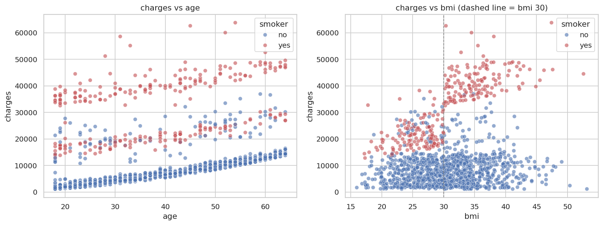
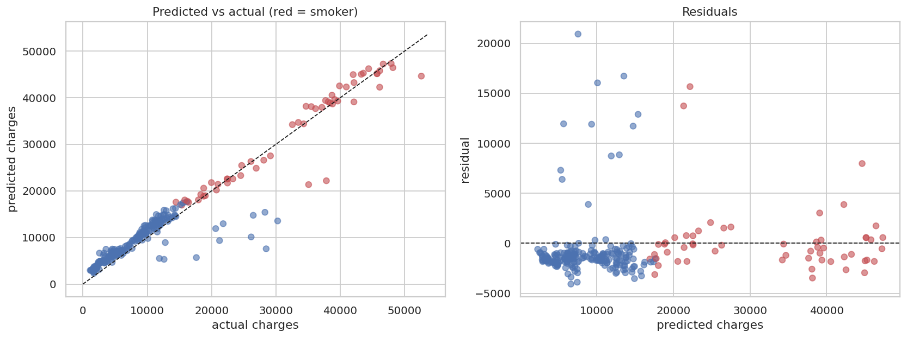
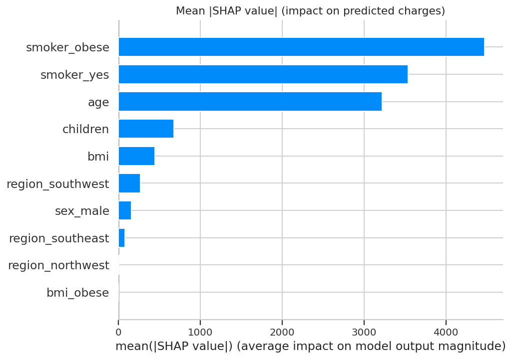

# Predicting Medical Insurance Charges: What Drives the Bill, and How Well Can We Predict It?

**Regression with a leakage-safe scikit-learn pipeline, XGBoost, and SHAP explanations**


**MD. Sakib Al Hasan** | Data Science Portfolio Project

I compared seven regression algorithms (plus a log-target variant of linear regression) on 1,337 policyholder records to predict yearly medical charges. The best tuned model (XGBoost) reaches an average test R² of 0.854 and RMSE of about $4,565 over 20 random splits. Plain linear regression with two engineered features gets to within about $26 of that, so on this dataset the useful insight is *which factors matter* (smoking status above all) more than which algorithm wins.

---

## Problem Statement

Health insurers set premiums before they know who will actually get sick, so they price on a handful of known factors. If those factors are misjudged, the plan either loses money on expensive members or overcharges cheap ones and loses them to competitors.

**Can we predict an individual's yearly medical charges from basic demographic and lifestyle information, and which of those factors should drive pricing?**

**Dataset:** [Medical Cost Personal Datasets](https://www.kaggle.com/datasets/mirichoi0218/insurance) (Kaggle).

|                |                                                                               |
| -------------- | ----------------------------------------------------------------------------- |
| Records        | 1,338 (1,337 after removing one exact duplicate)                              |
| Columns        | `age`, `sex`, `bmi`, `children`, `smoker`, `region`, and the target `charges` |
| Missing values | none                                                                          |
| Time period    | not documented (no date column)                                               |

This dataset is widely used in the book *Machine Learning with R* by Brett Lantz, and its collection details aren't documented, so I treat it as a practice dataset rather than real claims data. The findings show how the modelling works, not what a real insurer would see.

---

## Methodology

### 1. Cleaning

No missing values, so no imputation. There was one exact duplicate row (two identical 19-year-old males with the same charge down to the cent). With continuous charges, that looked like an entry error, so I dropped it: 1,338 → 1,337 rows.

### 2. The target is skewed

`charges` has a skewness of 1.52, with a long tail of very expensive cases. After a log transform it drops to -0.09. I tested a log-target linear model rather than assuming it would help. It didn't: CV R² fell from 0.842 to 0.469 in dollar terms, so I dropped the idea.

### 3. What the EDA showed

Smoking status is by far the strongest signal. Smokers are 20.5% of records but average $32,050 versus $8,441 for non-smokers (about 3.8×). Correlation with charges: smoker 0.787, age 0.298, BMI 0.198. All VIFs on the original features are below 1.7, so there's no multicollinearity to fix.

The more interesting finding was an interaction. BMI barely matters for non-smokers (obese vs non-obese average charge: ×1.11), but for smokers it nearly doubles the bill (×1.95).



### 4. Outliers: kept

139 rows fall outside the IQR fence for `charges` (7 by Z-score > 3). 98% of them are smokers, and 96% of those have BMI ≥ 30. They aren't errors, they're exactly the group the model needs to learn, so removing or capping them would have thrown away the most useful signal.

### 5. Feature engineering

Two row-wise features based on the interaction above: `bmi_obese` (BMI ≥ 30) and `smoker_obese` (smoker and BMI ≥ 30). They use no learned statistics, so there's no leakage risk. On a linear model they cut cross-validated RMSE by 25.1% (6,297 → 4,715) and raised R² from 0.722 to 0.842.

### 6. Leakage-safe setup

80/20 split (1,069 train / 268 test), stratified on `smoker` so both sides have the same smoker share (20.5%). Encoding, scaling and feature engineering all sit inside one scikit-learn `Pipeline`, so they're fitted on training folds only. Validation is 5-fold CV inside the training set. The test set was only used after the model was chosen.

### 7. Model comparison (5-fold CV, training set)

Seven algorithms were compared, plus one variant (linear regression on a log-transformed target).

| Model               | Approach                       | CV R² | CV RMSE | CV MAE |
| ------------------- | ------------------------------ | ----- | ------- | ------ |
| Ridge               | Regularised linear             | 0.842 | 4,715   | 2,702  |
| Linear Regression   | Baseline + engineered features | 0.842 | 4,715   | 2,694  |
| Gradient Boosting   | Sequential trees               | 0.835 | 4,818   | 2,769  |
| Random Forest       | Bagged trees                   | 0.816 | 5,069   | 2,923  |
| Decision Tree       | Single tree, depth 5           | 0.812 | 5,159   | 3,060  |
| KNN                 | k=7, scaled                    | 0.801 | 5,314   | 3,311  |
| XGBoost             | Gradient boosting              | 0.791 | 5,387   | 3,160  |
| Linear (log target) | Log-transformed target         | 0.469 | 8,762   | 4,256  |

A dummy model that always predicts the mean scores R² -0.015 (RMSE 12,098), which is the floor. With default settings the linear models were on top, and the gaps among the top few are inside fold-to-fold noise (R² std ≈ 0.04).

### 8. Hyperparameter tuning

Gradient Boosting: full grid search (54 combinations). Random Forest: randomized search, 25 iterations. XGBoost: randomized search, 40 iterations. All scored on CV RMSE.

| Model             | CV RMSE default | CV RMSE tuned | Change |
| ----------------- | --------------- | ------------- | ------ |
| Gradient Boosting | 4,818           | 4,700         | -2.5%  |
| Random Forest     | 5,069           | 4,714         | -7.0%  |
| **XGBoost**       | 5,387           | **4,696**     | -12.8% |

### 9. Final model selection

XGBoost won on CV RMSE, but by under 0.4% over the other two (4,696 vs 4,700 vs 4,714). That's a coin flip, not a real gap. Random Forest scored slightly better on the test set, but I kept XGBoost because the rule was fixed on CV before touching the test set. Best parameters: `learning_rate=0.03, max_depth=3, n_estimators=200, min_child_weight=10, subsample=0.85, reg_lambda=10`.

---

## Results

**Original split** (single 80/20 split, test set of 268 rows):

| Model                         | R²        | RMSE ($)  | MAE ($)   |
| ----------------------------- | --------- | --------- | --------- |
| Dummy (mean)                  | -0.001    | 12,013    | 9,081     |
| Linear Regression             | 0.918     | 3,440     | 2,140     |
| Gradient Boosting (tuned)     | 0.921     | 3,384     | 2,116     |
| Random Forest (tuned)         | 0.922     | 3,357     | 2,099     |
| **XGBoost (tuned), selected** | **0.921** | **3,373** | **2,074** |

**Same comparison averaged over 20 random splits** (the number I'd actually quote):

| Model               | R²        | RMSE ($), mean ± std | MAE ($)   |
| ------------------- | --------- | -------------------- | --------- |
| Linear Regression   | 0.852     | 4,591 ± 542          | 2,498     |
| **XGBoost (tuned)** | **0.854** | **4,565 ± 535**      | **2,512** |

**Being honest about these numbers:**

- The original split was a favourable draw. Test RMSE there (3,373) is well below the 5-fold CV RMSE (4,696) and the 20-split average (4,565). A different random split could easily have given a worse-looking result.
- XGBoost beat linear regression in 13 of 20 splits, by about $26 on average RMSE. That's not a meaningful difference. The 20-split check reuses hyperparameters tuned on the original training split, so it slightly favours the tuned model, and it still comes out close.
- Errors are concentrated. 14 of the 268 test predictions were off by more than $5,000, 11 of them non-smokers, and together they account for 75.7% of the total squared error. These are non-smokers with bills of roughly $12k to $30k that nothing in the seven columns explains.



**Accuracy by group** (test set): in relative terms the model is far more accurate for smokers than for non-smokers.

| Group       | n   | MAE ($) | MAE as % of mean charge |
| ----------- | --- | ------- | ----------------------- |
| Non-smokers | 213 | 2,124   | 26.8%                   |
| Smokers     | 55  | 1,882   | 5.8%                    |

**What the model uses (SHAP, mean |value|):**

| Feature        | Impact ($) |
| -------------- | ---------- |
| `smoker_obese` | 4,472      |
| `smoker_yes`   | 3,537      |
| `age`          | 3,223      |
| `children`     | 676        |
| `bmi`          | 448        |
| region, sex    | < 270 each |

`bmi_obese` gets exactly 0, presumably because `smoker_obese` covers it. The model mostly needs three things: smoker status, the smoker-and-obese flag, and age.



**Customer segments** (all 1,337 records):

| Segment              | Share | Average charges | Defining traits                                                            |
| -------------------- | ----- | --------------- | -------------------------------------------------------------------------- |
| Non-smoker, BMI < 30 | 37.5% | $7,977          | Lowest-cost group; charges rise smoothly with age                          |
| Non-smoker, BMI ≥ 30 | 42.0% | $8,856          | Nearly the same as above (×1.11); BMI adds little                          |
| Smoker, BMI < 30     | 9.6%  | $21,363         | Mid-cost; about 2.7× the non-smoker, BMI < 30 group (2.5× all non-smokers) |
| Smoker, BMI ≥ 30     | 10.8% | $41,558         | Highest-cost; 98% of the IQR charge outliers are smokers                   |

---

## Business Implications

**Smokers with BMI ≥ 30 make up 10.8% of records but average $41,558, about 4.9× the average non-smoker ($8,441).**

| Finding                                                       | Suggested action (for a non-technical reader)                                                                |
| ------------------------------------------------------------- | ------------------------------------------------------------------------------------------------------------ |
| Smoking status dominates cost                                 | Treat it as the primary pricing/risk factor; verify it (self-reported status can be wrong)                   |
| Smoking × obesity is the top-cost segment                     | Target cessation and weight-management programmes at this group first, where any reduction is worth the most |
| Non-smokers cost about the same regardless of BMI             | Don't apply a blanket BMI surcharge; on this data it isn't supported                                         |
| Region, sex and children have small effects                   | Low priority for pricing or targeting                                                                        |
| Some non-smokers have very high bills the model can't explain | Look for missing information (diagnoses, prior claims) before trusting predictions for individuals           |

**Suggested next step.** Validate this on real claims data before using it for anything. The seven columns here miss the things that drive cost in practice (diagnoses, claims history, plan design), and the unexplained high-bill non-smokers are probably where those would matter. Also check which rating factors are legally allowed in your market: in the US individual market, for example, BMI isn't a permitted pricing factor, so a model like this would be for risk analysis rather than pricing.

---

## Repository Structure

```
Insurance-charges-regression/
├── README.md                     # this file
├── requirements.txt              # pinned package versions
├── LICENSE                       # MIT (code)
├── data/
│   └── insurance.csv             # raw dataset (55 KB, source linked above)
├── notebooks/
│   └── analysis.ipynb            # full EDA + modelling notebook, executed
├── src/
│   ├── preprocessing.py          # cleaning, feature engineering, pipeline builder
│   ├── train.py                  # retrain final model from saved best params
│   └── predict.py                # command-line prediction for one person
├── models/
│   └── model_pipeline.pkl        # saved final pipeline (XGBoost)
└── reports/
    ├── best_params.json          # tuned hyperparameters
    ├── metrics.json              # final metrics, original split
    ├── cv_model_comparison.csv   # 8-row CV table (7 algorithms + log-target variant)
    ├── tuning_results.csv        # default vs tuned CV RMSE
    ├── test_results.csv          # test-set table, original split
    ├── split_stability.csv       # 20-split results
    └── figures/                  # all plots used in the notebook
```

---

## Environment & Reproducibility

Tested on Python 3.12. Package versions are pinned in `requirements.txt`.

```
git clone https://github.com/sakibzzz641/Insurance-charges-regression.git
cd Insurance-charges-regression
python -m venv .venv && source .venv/bin/activate   # Windows: .venv\Scripts\activate
pip install -r requirements.txt
```

The dataset is already in `data/`, so no download step is needed.

```
# retrain the final model and print test metrics (from the repo root)
python -m src.train

# predict for one person
python -m src.predict --age 35 --sex male --bmi 32 --children 1 --smoker yes --region southeast
```

For the same profile, the model predicts about $39,030 for a smoker and $6,447 for a non-smoker.

To re-run the notebook, install Jupyter (`pip install jupyterlab`) and open `notebooks/analysis.ipynb`. All random seeds are fixed at 42.

---

## License

The dataset is listed on Kaggle under the Open Database License (ODbL), which allows sharing and adapting the data as long as you attribute it and keep derived databases under the same terms. The code and analysis in this repository are released under the MIT License, so you can reuse them with attribution.

---

## Contact

**MD. Sakib Al Hasan**. Always happy to talk about data science, machine learning and how to make models honest.

[](mailto:sakibzzz641@gmail.com) [](https://github.com/sakibzzz641) [](https://www.linkedin.com/in/sakibzzz641/)

